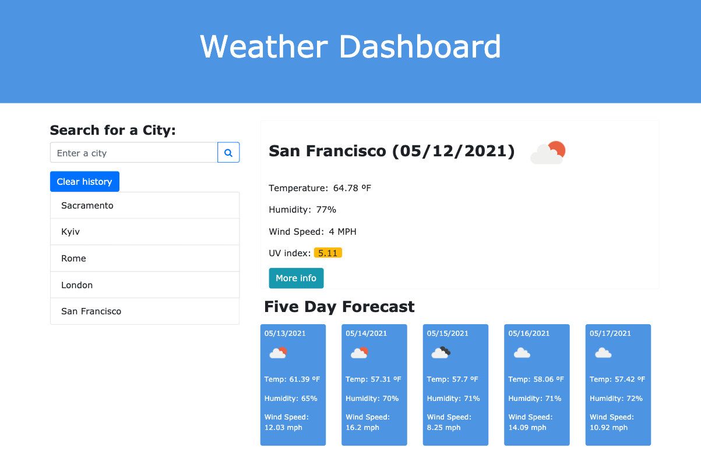

# Weather_Dashboard

## The goal:
To build a weather dashboard that will run in the browser and feature dynamically updated HTML and CSS.

##Technologies: 
[Bootstrap](https://getbootstrap.com/), JavaScript, jQuery, [Moment.js](https://momentjs.com/).

##API: [Current Weather Data](https://openweathermap.org/current), [5 day weather forecast](https://openweathermap.org/forecast5).

Enter the name of the city in the search field and click the search button. The current weather and forecast will appear to the right. To see more info, click the **More Info** button.

The name of the city is added to the list below the search field. To see the weather and forecast for the city from the history, click the name of the city in the list. To clear the list, click the **Clear History** button.

If you enter an invalid city name, the search field border will turn red. 

[Deployed web app](https://vasylynash.github.io/Weather_Dashboard/)

